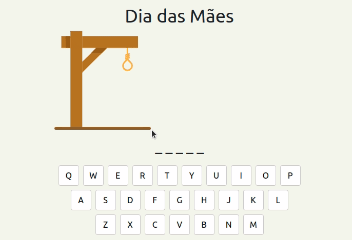

# O desafio da forca

Olá! Você está prestes a iniciar o nosso desafio para a seleção do StartDB. Se você chegou aqui sem conhecer o StartDB, você pode encontrar mais informações [neste link](https://start.dbserver.com.br/). O desafio desse ano será desenvolver as regras de um jogo da forca. 
Você conhece o jogo da forca?

 

> **Observação:** *Dia das mães* no gif acima é a dica sobre a palavra secreta

É um jogo que antigamente necessitava de duas pessoas, uma para selecionar a palavra secreta e outra para tentar acertar. A pessoa que escolhia a palavra desenhava/registrava tudo no papel, desde o desenho da forca, as letras acertadas e letras erradas. Algo muito próximo do gif acima.

